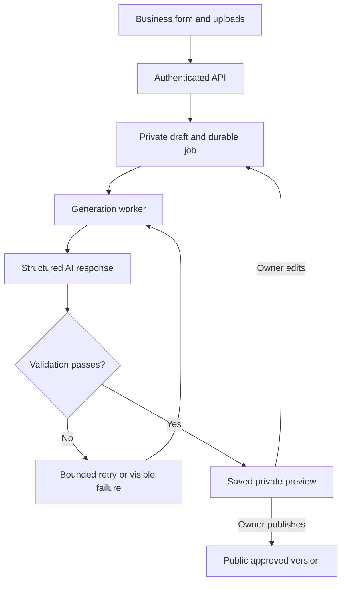

# PLAN: SiteForge automatic business websites

**Status:** implementation in progress, with verified repository grounding and explicit launch gates.
**Created:** 2026-09-10
**Scope of this change:** executable plan and implementation tracking.
**Target repository:** `noamgruber-cyber/Business-websites`.
**Inspected branch:** `claude/siteforge-homepage-ryOsQ`.
**Inspected commit:** `9bd37cce88259e0c5a7c1a5ebc451526e559f5b9`.

## Shared context

### Product brief and working assumptions

A small business owner signs into SiteForge, enters business details, uploads photos, and clicks Generate website. The system automatically chooses a supported design, drafts copy, arranges the supplied images, checks the result, and saves a private preview. The owner can correct details and publish the exact version they reviewed. Generation continues if they close their browser. Routine success does not require the platform operator.

The original phrase 'a small website can send us details' is interpreted as a business using a form on our website. The planning interview returned no answers, so these are explicit proposed defaults: form submission, one-page business sites, and customer approval before publication. If the intended source is another website submitting through an API, preserve the generation service below and add API-key authentication as a later intake adapter.

Extend the existing SiteForge application. The repository was selected because its name, README, forms, templates, and publication flow directly match this request. Do not start a replacement application or change providers without revising this plan.

### First release

- One business site per account during the pilot; six existing categories: barbershop, restaurant, nail_salon, gym, cafe, photography.
- Hebrew or English per generated site, explicitly chosen by its owner. Existing application language options remain available. Public content direction is tied to site language, not the visitor's saved editor preference.
- One responsive page: hero, about, services or menu, gallery, opening hours, and contact. Omit sections with no supplied content.
- Up to eight images: one logo, one cover, and six gallery images. Images are optional; use a designed text-only hero when there is no photo.
- Contact actions: phone, WhatsApp, email, and owner-supplied social links. A WhatsApp action opens a conversation; no booking or order completion is implied.
- AI may improve wording and choose among reviewed layout recipes and palettes. It cannot invent prices, business history, qualifications, reviews, menu facts, dietary claims, or contact details.
- Persisted drafts, generation progress, editable previews, publish, unpublish, and rollback to a previously approved version.
- Publish at the existing `/b/{slug}` route on one hosted application. Publishing a customer site changes data, not application code or GitHub deployments.
- Pilot limits: one active generation per site, three generation requests per owner per UTC day, and a configurable platform-wide daily admission cap. Infrastructure retries count within the original generation request.

Custom domains, payments, shopping carts, actual booking, automated lead messages, public third-party API keys, scraping existing websites, arbitrary generated code, per-business repositories, and full drag-and-drop editing are follow-up work. These limits make the first release testable and operable.

### Example and acceptance

An owner selects barbershop and Hebrew, types a name and a short description, enters a haircut price, adds a phone number and four photographs, and requests a clean design. SiteForge saves the draft, produces a Hebrew preview with those exact facts and selected photographs, and lets the owner edit the proposed copy. Clicking Publish reserves a slug and exposes that version. A later failed generation must not change the live site. This is a scenario, not a claim about any real business.

Pilot acceptance: at least ten distinct, consented or synthetic briefs across the six categories, including Hebrew, English, no images, no prices, long business names, and sparse content. Every publishable output has working contact links, no unsupported factual additions, correct image ownership, no visible placeholders, and no horizontal overflow at 375, 768, and 1440 CSS pixels. Measure completion rate, queue wait, generation latency, retries, and provider usage; do not advertise a completion time before measuring it.

### Verified repository facts

Source inspection was performed through the GitHub plugin. No application build, runtime test, deployed Firestore rule inspection, or production-data inspection was performed during planning. The execution environment became unavailable, so repository API reads provide the grounding. The existing QA report is historical evidence, not a fresh passing test.

| Item | Verified fact at the inspected commit |
|---|---|
| Application root | `siteforge/` |
| Locked versions | Next.js 14.2.5; React/React DOM 18.3.1; Firebase 10.14.1; Cloudinary 2.9.0; TypeScript 5.9.3; Tailwind 3.4.19; Zustand 5.0.11 |
| Existing commands | `npm run dev`, `npm run build`, `npm run start`, `npm run lint`; no typecheck or test script |
| Forms | `app/create/page.tsx`, `app/edit/[businessId]/page.tsx`, and `components/editor/Step1_BasicInfo.tsx` through `Step5_Publish.tsx` |
| Editor state | `lib/businessStore.ts` uses in-memory Zustand; an editor refresh without matching state redirects to creation |
| Authentication | `lib/auth.ts` and `context/AuthContext.tsx` use Firebase Google sign-in; `siteforge_auth=1` is an unsigned navigation hint |
| Middleware | `middleware.ts` checks that hint for create/edit/dashboard navigation; it is not server authentication |
| Persistence | `lib/firestore.ts` reads and writes `businesses/{slug}` from the Firebase client SDK |
| Publication | `Step5_Publish.tsx` checks availability, then separately calls `saveBusiness`; no transaction connects those operations |
| Uploads | `app/api/upload/route.ts` accepts multipart and calls Cloudinary; file presence and allowed formats are checked, but authentication and byte limits are absent in the inspected handler |
| Public site | `app/b/[slug]/page.tsx` loads live data with mock fallback and switches between templates |
| Templates | `lib/templateConfigs.ts` defines 18 palette/design IDs across six categories; sample variant code contains hardcoded English labels and layout values |
| Preview | `components/editor/LivePreview.tsx` is a separate miniature representation, not the public renderer |
| Existing facts | `BusinessData` mixes public business fields with owner UID, email, name and photo; defaults seed sample services, prices and opening hours |
| Locale | `context/LanguageContext.tsx` changes document language/direction from browser or localStorage; generated site locale needs isolation |
| Security/deployment files | No AGENTS.md, Firestore rules, Firebase deployment config, or `.openai/hosting.json` appeared in the inspected root/application trees |

Paths listed as **create** below are proposed new files, not claims about existing code. Existing files explicitly targeted for change were inspected unless a step instructs its executor to read a neighboring file first. All paths below are relative to `siteforge/` unless prefixed with `repo:`.

### Architecture decisions

| Concern | Decision | Reason |
|---|---|---|
| Frontend and public sites | Keep Next.js, React, Tailwind and the existing SiteForge branding | Reuse the actual product and workflows |
| Identity and data | Keep Firebase Auth and Firestore; add Firebase Admin on the server | Avoid replacing existing identity/data services |
| Images | Keep Cloudinary, add authenticated ingestion and asset records | Track ownership and distinguish drafts from public content |
| Generation | OpenAI Responses API with strict structured output; model selected through `OPENAI_MODEL` after a capability/cost smoke test | Consume validated data, with no generated program execution |
| Background processing | One Render background worker, running the same repository's generation modules; durable Firestore job documents | Requests survive browser closure and worker restarts |
| Rendering | New shared `GeneratedSite` renderer for versioned sites, using reviewed recipes and existing palette metadata | Preview and publication use identical markup without inheriting all legacy demo assumptions |
| Hosting | Retain a commercial-capable Vercel deployment for the app, plus Render for the worker | Matches the repository deployment direction; verify account plans before launch |
| GitHub | One repository for code, recipes, schema, prompts, migrations and CI | Customer uploads and private submissions stay out of git |

The generated site is a stored blueprint plus deterministic rendering. It is a real business website on a stable URL, but it is not a separately authored codebase. A request for unrestricted custom layouts would expand the product and execution sandbox substantially.



## Contracts

### C1. Data types and validation

Create these interfaces in `lib/siteContracts.ts`. Add runtime schemas in `lib/siteSchemas.ts`. All object schemas reject unknown keys. JSON payloads use ISO-8601 UTC strings; Firestore storage uses Timestamp for operational dates, converted at the API boundary. IDs are UUIDs except slug documents and deterministic job-version IDs. Missing optional facts use null, not invented values. Draft validation permits incomplete facts; generation validation applies the completeness rules below.

```ts
import type { BusinessCategory } from './types';

export type SiteLanguage = 'he' | 'en';
export type DesignStyle = 'auto' | 'clean' | 'warm' | 'bold';
export type Day = 'sunday' | 'monday' | 'tuesday' | 'wednesday'
  | 'thursday' | 'friday' | 'saturday';
export type Hours = { day: Day; value: string | null };
export type ServiceFact = {
  id: string; name: string; description: string | null; priceText: string | null;
};
export type BusinessFacts = {
  businessName: string;
  category: BusinessCategory;
  language: SiteLanguage;
  description: string;
  services: ServiceFact[];
  phone: string | null;
  whatsapp: string | null;
  email: string | null;
  address: string | null;
  city: string | null;
  instagramUrl: string | null;
  facebookUrl: string | null;
  openingHours: Hours[];
};
export type IntakeV1 = {
  schemaVersion: 1;
  facts: BusinessFacts;
  style: DesignStyle;
  imageAssetIds: string[];
  rightsConfirmed: boolean;
};
export type AssetRecord = {
  id: string; siteId: string; ownerUid: string;
  role: 'logo' | 'cover' | 'gallery';
  status: 'reserved' | 'ready' | 'rejected';
  privatePublicId: string | null;
  publicPublicId: string | null;
  sha256: string | null;
  mime: 'image/jpeg' | 'image/png' | 'image/webp' | null;
  bytes: number | null; width: number | null; height: number | null;
  createdAt: string; updatedAt: string;
};
export type SectionId = 'about' | 'services' | 'gallery' | 'hours';
export type GeneratedDraftV1 = {
  schemaVersion: 1;
  templateId: string;
  layout: 'split' | 'centered' | 'gallery_first';
  tagline: string;
  about: string;
  heroAssetId: string | null;
  galleryAssetIds: string[];
  imageAlts: { assetId: string; text: string }[];
  sections: SectionId[];
};
export type SiteBlueprintV1 = GeneratedDraftV1 & {
  facts: BusinessFacts;
  logoAssetId: string | null;
  sourceRevision: number;
};
export type QaReport = {
  passed: boolean;
  errors: { code: string; path: string; message: string }[];
  warnings: { code: string; path: string; message: string }[];
};
export type VersionRecord = {
  id: string; siteId: string; sourceRevision: number;
  blueprint: SiteBlueprintV1;
  source: 'ai' | 'manual_edit' | 'legacy_import';
  parentVersionId: string | null;
  qa: QaReport;
  rendererVersion: '1'; promptVersion: string | null; model: string | null;
  createdAt: string;
};
export type SiteRecord = {
  id: string; ownerUid: string; draftRevision: number; draft: IntakeV1;
  latestVersionId: string | null; publishedVersionId: string | null;
  publicationRevision: number; activeJobId: string | null;
  slug: string | null; suspended: boolean; deletedAt: string | null;
  createdAt: string; updatedAt: string;
};
export type JobState = 'queued' | 'generating' | 'validating'
  | 'ready' | 'failed' | 'cancelled';
export type JobRecord = {
  id: string; siteId: string; ownerUid: string; sourceRevision: number;
  inputSnapshot: IntakeV1; state: JobState; attempt: number;
  modelCallCount: number; nextAttemptAt: string;
  leaseToken: string | null; leaseExpiresAt: string | null;
  candidate: GeneratedDraftV1 | null; resultVersionId: string | null;
  providerResponseId: string | null;
  usage: { inputTokens: number; outputTokens: number; estimatedCostUsd: number | null };
  errorCode: string | null; createdAt: string; updatedAt: string;
};
export type ApiErrorCode = 'UNAUTHENTICATED' | 'NOT_FOUND' | 'INVALID_INPUT'
  | 'REVISION_CONFLICT' | 'JOB_ACTIVE' | 'IDEMPOTENCY_CONFLICT'
  | 'LIMIT_REACHED' | 'SLUG_TAKEN' | 'UPLOAD_REJECTED'
  | 'GENERATION_FAILED' | 'SERVICE_UNAVAILABLE';
export type ApiResult<T> =
  | { ok: true; data: T; requestId: string }
  | { ok: false; error: { code: ApiErrorCode; message: string;
      fieldErrors?: Record<string, string> }; requestId: string };
```

Completeness: trimmed name 1-100 characters; description 20-2000 characters; at least one valid phone, WhatsApp number or public email; 0-30 services with names 1-100, descriptions <=500, priceText <=80; each optional contact/address field <=300; hours are seven unique days in the declared order, each null, `closed`, or one `HH:mm-HH:mm` interval. Unknown hours stay null; overnight ranges are allowed and displayed without claiming live open/closed status. Phone/WhatsApp inputs require E.164 format with a country selector in the UI, never assume Israel for all users. Instagram/Facebook accept HTTPS URLs on their actual service domains, no credentials or executable schemes. All images must be ready and owned by the same owner/site. All uploaded-image submissions require rightsConfirmed=true.

Draft copy limits: tagline <=100, about <=1200, alt text <=160, gallery <=6. AI cannot output fact fields or image URLs. `templateId` must exist in the category-filtered registry; use only isPremium=false entries until an entitlement system exists. `sections` must be duplicate-free and correspond to available facts/assets; contact and hero are always deterministic. Price, hours and contact data are copied from the input snapshot in server code. Generated prose can still contain factual errors despite schema validation, so the owner reviews copy explicitly before publication; automated checks are not advertised as truth verification.

### C2. Storage and access

| Firestore path | Stored shape and access |
|---|---|
| `ownerAccounts/{uid}` | `{siteId: string or null, updatedAt}`; server-only transactional guard for one pilot site; release after completed deletion cleanup |
| `sites/{siteId}` | SiteRecord, server writes only; owner reads only through API |
| `sites/{siteId}/versions/{versionId}` | Immutable VersionRecord; API owner access |
| `assets/{assetId}` | AssetRecord; private server access |
| `generationJobs/{jobId}` | JobRecord; private server access |
| `siteSlugs/{slug}` | `{siteId, ownerUid, createdAt}`; server-owned reservation |
| `publicSites/{slug}` | `{siteId, versionId, publicationRevision, language, blueprint, media: [{assetId,url}], publishedAt}`; public facts only |
| `operationKeys/{sha256}` | `{ownerUid, route, key, payloadHash, response, createdAt}`; server only; retain 30 days |
| `generationUsage/{uid_utcDate}` | `{admitted, modelCalls, inputTokens, outputTokens}`; server only |
| `platformUsage/{utcDate}` | `{admitted, modelCalls, inputTokens, outputTokens}`; server only |
| `auditEvents/{uuid}` | `{actorUid, action, siteId, versionId, requestId, createdAt}`; server only |
| `uploadUsage/{uid_utcHour}` | `{requests, reservedBytes, acceptedBytes}`; server-only quota counters |
| `uploadReservations/{assetId}` | `{siteId, ownerUid, payloadHash, expiresAt, byteAllowance}`; server only |

Use an explicit serializer to publicSites, never object-spread a private SiteRecord. No owner email, login name, ownership IDs beyond the opaque siteId, input prompt, unpublished version, job status, or provider metadata is public. Database rules deny direct client reads/writes to v2 collections; all requests go through authenticated Next.js routes. Public pages use a narrow server reader. Firebase Admin bypasses rules, so ownership validation is required in every server service, not merely in UI or rules.

Indexes: generationJobs `(state ASC, nextAttemptAt ASC)` for queued work and `(state ASC, leaseExpiresAt ASC)` for recovery; sites `(ownerUid ASC, updatedAt DESC)`; assets `(siteId ASC, createdAt ASC)`; auditEvents `(siteId ASC, createdAt DESC)`. Exempt large draft, blueprint, inputSnapshot, candidate, and QA maps from indexing. Keep documents below 500 KiB through input/output limits. Keep timestamps from the server and quota boundaries in UTC.

### C3. Server authentication and API

Preserve Firebase Google login. Exchange a fresh Firebase ID token for a verified Firebase session cookie in `/api/session`. Cookie: `siteforge_session`, HttpOnly, Secure in HTTPS environments, SameSite=Lax, path=/, five-day lifetime. Validate cookies with Firebase Admin on every private request, including ownership and suspension state. Reject tokens from another Firebase project. Check same-origin Origin on every cookie-authenticated mutation and the session exchange. Reject cross-origin mutation attempts and do not enable wildcard CORS. GETs have no mutation side effects.

`GET /api/session` verifies session; `POST /api/session` takes the Firebase ID token in Authorization and creates a session after freshness checks; `DELETE /api/session` clears it. AuthContext checks for an existing valid session before exchanging; an old token auth_time with no session requires reauthentication. `siteforge_auth` is removed at cutover. Middleware remains a navigation convenience; API and protected data loaders enforce security independently.

All mutation JSON bodies are <=64 KiB except the bounded image upload route. Auth failure is 401; foreign or absent site IDs return 404; validation 400; body too large 413; revision/slug conflicts 409; quota 429; unavailable provider 503. Private API responses and previews use `Cache-Control: private, no-store`. The `Idempotency-Key` header is required for creation, generation and publication, with key scope `(uid, route)` and stored payload hash; a repeated key with a different body is 409.

| Method and path | Request | Success |
|---|---|---|
| POST `/api/sites` | `{category, language}` | 201 `{site}` with blank draft and revision 0 |
| GET `/api/sites` | none | 200 `{sites: SiteRecord[]}` for owner, newest first |
| GET `/api/sites/{id}` | none | 200 `{site, versions: VersionRecord[], job: JobRecord or null}`; omit operational lease and provider internals from owner job DTO |
| PUT `/api/sites/{id}/draft` | `{expectedRevision, intake}` | 200 `{site}` with incremented draftRevision |
| POST `/api/sites/{id}/assets` | `{role, fileName, bytes, mime}` | 201 `{assetId}` with reservation |
| POST `/api/upload` | multipart `{siteId, assetId, file}` | 200 `{assetId, status:'ready'}`; no direct public draft URL |
| GET `/api/media/{assetId}` | valid session for private asset | image bytes after owner verification; no-store |
| POST `/api/sites/{id}/generate` | `{expectedRevision}` | 202 `{jobId,state}` |
| POST `/api/sites/{id}/jobs/{jobId}/cancel` | none | 200 current state; no new provider calls after cancellation observed |
| POST `/api/sites/{id}/versions` | `{expectedRevision, baseVersionId, blueprint}` | 201 `{version}` after owner edits and validation |
| POST `/api/sites/{id}/publish` | `{versionId, expectedPublicationRevision, slug, contentConfirmed:true}` | 200 `{url,versionId,publicationRevision}` |
| POST `/api/sites/{id}/unpublish` | `{expectedPublicationRevision}` | 200 `{publicationRevision}` |
| DELETE `/api/sites/{id}` | `{expectedPublicationRevision}` | 202 after soft deletion and unpublication |

`GET /api/ops/jobs` returns bounded operational job metadata to sessions with the `siteforgeAdmin=true` Firebase custom claim. `POST /api/ops/sites/{id}/suspend` accepts `{suspended:boolean}`, requires that claim and same-origin checks, records an audit event, and removes public routing when suspended. Un-suspension does not republish automatically. Admin status never comes from client-editable Firestore fields.

`GET /studio/{id}` is the new persisted editor shell. `/create/auto` is the new form entry. The editor loads its private data through authenticated APIs, handles session expiry, and never exposes private content in server HTML before authorization. No share-by-guessable-ID preview links.

Service functions, all server-only:

```ts
requireOwner(request: Request, siteId: string): Promise<{ uid: string; site: SiteRecord }>;
saveDraft(uid: string, siteId: string, expectedRevision: number, intake: IntakeV1): Promise<SiteRecord>;
enqueueGeneration(uid: string, siteId: string, expectedRevision: number, key: string): Promise<JobRecord>;
claimJob(workerId: string): Promise<JobRecord | null>;
generateDraft(input: IntakeV1, images: { assetId: string; dataUrl: string }[]): Promise<GeneratedDraftV1>;
validateBlueprint(blueprint: SiteBlueprintV1, intake: IntakeV1, assets: AssetRecord[]): QaReport;
publishVersion(uid: string, siteId: string, versionId: string, expectedPublicationRevision: number, slug: string, key: string): Promise<{ url: string; publicationRevision: number }>;
```

### C4. Job state, retries and cost control

| Current state | Event | Next state / effect |
|---|---|---|
| queued | worker wins transactional lease | generating; increment attempt, set token and expiry |
| generating | validated structured candidate persisted | validating; keep lease and persist candidate |
| validating | all required checks pass | ready; create immutable version with deterministic ID equal to jobId |
| generating/validating | transient failure, attempts remain | queued; clear lease, set nextAttemptAt |
| queued/generating/validating | user cancels | cancelled; revoke lease token, clear activeJobId |
| generating/validating | terminal error or exhausted attempts | failed; clear activeJobId |
| generating/validating | lease expires | recovery transaction queues it again or fails at attempt cap |
| ready/failed/cancelled | any duplicate worker completion | no-op |

Enqueue transaction reads owner quota, platform quota, SiteRecord, and operation key, then creates the job and sets activeJobId in the same transaction. It snapshots the exact draft and revision. At most one nonterminal job per site. Draft updates while an active job exists return JOB_ACTIVE; UI offers Cancel and edit. This prevents an older job from silently replacing newer input.

Worker polls queued jobs every 10 seconds and expired leases every 30 seconds, with bounded pages of 10. There is one worker and concurrency 1 for the pilot. Claim/recovery occurs inside Firestore transactions. Lease lasts 180 seconds, renewed every 30 seconds; every write checks leaseToken, nonterminal state, activeJobId, and sourceRevision. Never make model, media, or other network calls inside a transaction callback, because it can rerun. A stale worker can spend an already-started call but cannot commit its result.

Maximum three claims and three model calls per job, counting retries and interrupted attempts. Persist the model-call reservation before calling the provider. Disable hidden SDK retries so they cannot multiply this limit. Transient 429/5xx/network errors retry after 15 then 60 seconds plus 0-5 seconds jitter. Respect Retry-After when longer, up to ten minutes; above that mark unavailable. Authentication/permission errors fail immediately and surface in operator status. A refusal fails with an actionable edit message. Malformed/schema-invalid output gets at most one repair call within the three-call limit; deterministic ownership or link violations fail immediately. Persist a valid candidate before visual checks so validation retry reuses it.

Each model call has a 90-second client timeout and max_output_tokens=4000. Cap submitted text by C1 and use at most six 768-pixel image derivatives. Do not assume an HTTP timeout cancels a billable provider operation. Admission limits, bounded calls, and measured usage are controls; they are not a guarantee against all infrastructure charges.

Server configuration: `AI_GENERATION_ENABLED=false` until the pilot smoke test; `MAX_GENERATIONS_PER_OWNER_DAY=3`; `MAX_GENERATIONS_GLOBAL_DAY=20`; `MAX_MODEL_CALLS_PER_JOB=3`; `OPENAI_MODEL` has no invented default. At launch, resolve and record a supported vision+structured-output model available to the actual account, verify its current pricing, and set it in both environments. Fail closed when the model is unset. Mock generation is permitted only with an explicit local/test configuration.

### C5. Media lifecycle

The upload request body is capped at 3.25 MiB, below the documented Vercel function body limit. Eight attached images maximum, each <=3 MiB and <=20 megapixels. Accept JPEG, PNG and WebP only. Explain unsupported HEIC uploads clearly to iPhone users with instructions to upload a JPEG; HEIC conversion is a later feature. Reserve upload slots and aggregate byte allowance server-side, including concurrent reservations. Per UTC clock-hour cap: 20 reservations per owner and 60 MiB accepted/reserved bytes. Expire unused reservations after 15 minutes.

Consume multipart as a bounded stream, with a 3 MiB file limit and a small multipart overhead allowance. Do not trust Content-Length or browser MIME. Decode with sharp under a pixel/memory limit, reject corrupt or animated content, normalize orientation, strip metadata, and re-encode; never serve SVG/HTML. Upload sanitized bytes to Cloudinary with authenticated delivery, a deterministic `siteforge/v2/{siteId}/{assetId}` public ID, and overwrite=false. An ambiguous upload timeout is reconciled against that ID before retrying, not followed by creating a new ID.

Private preview images are fetched through the owner-authorized media route and are never assigned public Cloudinary URLs. Generation receives bounded sanitized derivatives via server code; it never fetches arbitrary customer URLs. Cloudinary authenticated delivery behavior and supported transformations must pass an early real-account smoke test.

On customer publication, create sanitized public copies for the exact version's asset IDs, using deterministic public IDs; upload/reconcile before the publication transaction. Only after those copies exist can publicSites reference them. Orphan copies from a failed publication are retried/reconciled and cleaned later. Site unpublication removes HTML immediately; previously public image URLs and outside caches may persist. Do not describe unpublish as immediate worldwide revocation of already published media.

Keep assets referenced by any retained version. Soft-delete a site immediately from public routing, cancel its active job, and delete its private data and provider assets after seven days through retryable cleanup. Unattached, unreserved assets older than 24 hours may be removed. Cleanup checks references and reservation expiry before deleting, uses deterministic IDs, and logs failures. A site with deletedAt set cannot be modified, generated, or republished.

### C6. Rendering, editing and publication

Use the same `GeneratedSite({blueprint, media, preview})` component for preview and public versions. Its children receive only public facts and resolved assets. Use text nodes, safe URL builders, and explicit props. Never execute AI code, accept raw CSS/HTML, use eval, or use dangerouslySetInnerHTML for copy. Any JSON-LD serialization must escape `<` and use known data fields.

Layouts are fixed reviewed recipes: split (text beside cover), centered (text above cover), and gallery_first (hero followed by available gallery). The schema may choose layout and section order; it may not place contact before hero or create a section without source content. Reuse `templateConfigs` category palettes with contrast correction. Generated versions use the new renderer; legacy/demo routes retain their current components until the migration/cutover step. Do not claim that all 18 legacy template implementations already meet the new quality contract.

Keep public rendering independent of the logged-in editor's LanguageProvider. Versioned public content must receive a server-rendered lang/dir on its root and stable labels from its language, including before hydration. The versioned public route returns its own HTML document, so the editor LanguageProvider cannot alter the public locale. Inside the studio, the preview root has an explicit lang/dir independent of the editor shell. Do not import AuthProvider into the generated site's own client component.

Edits to business facts save a new draft revision and require a new preview version before publish. Edits to AI copy/image order/style create an immutable manual_edit version bound to the current revision; baseVersionId must equal latestVersionId, otherwise return conflict. Editing blueprint facts is not allowed through the copy-edit endpoint. Review shows business facts and proposed prose, with a checkbox confirming the exact content. No silent publication after generation.

Publish transaction reads SiteRecord, target VersionRecord, slug reservation, legacy `businesses/{slug}` during coexistence, and operation key. Check owner, not deleted/suspended, QA passed, current sourceRevision, content confirmation, publicationRevision, and ready assets. Atomically reserve slug, write sanitized publicSites projection, set publishedVersionId, increment publicationRevision, and record the operation response. Concurrent requests from different owners for one slug yield exactly one success. New slug regex: `^[a-z0-9]+(?:-[a-z0-9]+)*$`, length 3-63; reserved demo and application names cannot be claimed. First publish fixes the slug for the MVP; changes require a later redirect feature.

Rollback is an explicit publish request for a previously approved version. It may reference an older sourceRevision only if the API receives `{rollback:true}` and that version appears in the audit history as previously published; normal publish requires current revision. Include this optional rollback flag in the publish request runtime schema. Rollback restores all public facts and images from that version, leaves the working draft unchanged, and increments publicationRevision. Unpublish atomically removes publicSites, clears publishedVersionId, increments publicationRevision, and retains the slug reservation.

Use dynamic/no-store public reads for the pilot so publication and removal do not depend on cross-instance cache invalidation. Database unavailability returns a real 503 response for the business route; missing/unpublished slugs return a real 404. A Next.js route implementation that can only render an error-looking page with HTTP 200 is insufficient. At the coordinated cutover, replace `app/b/[slug]/page.tsx` with `app/b/[slug]/route.ts` (they cannot coexist at the same route). The Node route handler reads the public projection once, uses React renderToStaticMarkup with the same pure renderer and checked-in CSS, and returns a complete HTML document with an explicit 200, 404, or 503 status. This static renderer uses standard anchors and CSS, so the public page needs no editor JavaScript or hydration. Complete the legacy migration before this switch. Preserve supported demo slugs through explicit labeled fixtures, never a general fallback. Canonical URL, title, description, Open Graph and escaped JSON-LD are emitted in this full HTML document. Validate the handler under the selected supported Next version before cutover.

### C7. Visual and quality contract

Retain the existing dark purple/blue editor direction. For new studio surfaces use background #0a0a0f, surface #151522, text #f8fafc, muted #cbd5e1, border #475569, accent #a78bfa, error #fca5a5, success #86efac. Primary button fill #6d28d9 with white text. Spacing: 4,8,12,16,24,32,48,64 px. Radii: 8,12,16 px. Body 16/24 normal; small 14/20; h2 24/32 bold; h1 32/40 bold. Focus: 2px accent ring, 2px offset. Transitions: 150ms ease-out and disabled for reduced motion.

At <768px the intake is one column and preview is a full-width toggle; 768-1023px use one column with a full preview beneath; >=1024px use a 60/40 studio split. Keep touch targets >=44px, label controls, announce save/job status with aria-live=polite, return focus from dialogs, and avoid overlapping fixed preview and navigation controls. Text contrast >=4.5:1, large text >=3:1. Generated palettes use deterministic black/white or darkened accent foreground correction to meet contrast, rather than arbitrary generated colors.

Required states: signed out, session expired, draft loading, saved, saving, unsaved/offline, validation error, image uploading/rejected, queued, generating, checking, preview ready, retry scheduled, failed, cancelled, publishing, published, unpublished and deleted. Do not show fake progress percentages. English job labels are 'Waiting to start', 'Building your website', 'Checking your website', 'Ready to review', and 'Could not finish. Your details are saved.' Supply Hebrew equivalents in `lib/autoCopy.ts` and render based on selected site/editor language.

Every generated version receives schema/facts/asset/link checks. Browser checks for all renderer fixtures run in CI at the three widths and both languages, including keyboard interaction and axe accessibility checks. A generation-time browser check uses React renderToStaticMarkup with the same pure renderer and its checked-in CSS, then Playwright setContent locally inside the worker. Pass authorized media as bounded data URLs and block all browser network requests. The renderer cannot depend on Next-specific server modules. There is no public preview URL and no API key inside the page. It verifies image load, missing targets, overflow and render errors. Save only its compact QaReport; no claim that automated accessibility checks certify legal compliance.

### C8. Migration and release

Do not assume there are zero live businesses. Inventory legacy records and deployed rules in a read-only prerequisite. Never deploy deny rules while old production clients are still the only writers. First prepare v2 APIs, compatibility readers, migration, and switched clients behind `SITEFORGE_V2_ENABLED`; then perform the tested cutover as a coordinated release.

Migration preserves existing slugs. Use deterministic IDs `sha256('legacy:'+slug)` represented as strings for migrated sites (an explicit exception to UUID IDs). Import only records with a verifiable ownerUid. Quarantine ownerless, duplicate-id, malformed, or unowned-media records for operator resolution, without assigning them to a guessed user. Flag seeded-looking prices/hours for review; do not delete confirmed real facts merely because they resemble defaults. Preserve an export and migration map before any write.

Before cutover, the legacy public route remains in service and v2 publication is disabled; owners can generate private previews. The migration imports every legacy site that must remain live before the route switch, or cutover is blocked with a list of unresolved records. After cutover, public lookup reads only publicSites and explicit demo fixtures; a missing projection is unpublished, with no legacy resurrection. New slug claims check both stores until legacy is archived. Existing owner routes are moved to server-side adapters before legacy writes are disabled. Public URLs and business content are preserved, while migrated sites adopt the reviewed renderer; capture and review those visual changes in staging. Rules for legacy businesses and analytics must be inventoried and explicitly preserved or tightened without allowing unauthorized writes to new collections.

Commercial hosting plans, model access, API credentials, Firebase Admin credentials, account upload capabilities, current dependency security, and the spending cap are launch gates. No free-production claim is made. Render polling itself consumes Firestore reads; measure idle and active operating cost. Platform AI limits do not cap hosting, image bandwidth, auth abuse, or all database costs.

## Verified external sources

Checked on 2026-09-10. These support provider behavior, not the proposed product choices or unmeasured performance.

- [Firebase session cookies](https://firebase.google.com/docs/auth/admin/manage-cookies): server session creation, expiry and verification support the session bridge.
- [Vercel function limits](https://vercel.com/docs/functions/limitations): check current payload limits when configuring image ingestion.
- [Firebase ID token verification](https://firebase.google.com/docs/auth/admin/verify-id-tokens): validate identity server-side instead of trusting a cookie flag.
- [Firestore transactions](https://firebase.google.com/docs/firestore/manage-data/transactions): make data changes atomic and keep external effects outside rerunnable transaction callbacks.
- [Firestore rule conditions](https://firebase.google.com/docs/firestore/security/rules-conditions): server SDK access uses server credentials; rules are not a substitute for server authorization.
- [Firestore indexes](https://firebase.google.com/docs/firestore/query-data/indexing): declare the compound indexes required by the job and owner queries.
- [Cloudinary Upload API](https://cloudinary.com/documentation/image_upload_api_reference) and [media access controls](https://cloudinary.com/documentation/control_access_to_media): validate the authenticated upload/delivery configuration against the real account.
- [OpenAI structured outputs](https://developers.openai.com/api/docs/guides/structured-outputs): schema-constrained responses require explicit handling of refusal and incomplete outputs.
- [Render background workers](https://render.com/docs/background-workers): a worker is separate from the request-serving web app.
- [Vercel Hobby](https://vercel.com/docs/plans/hobby) and [GitHub Pages limits](https://docs.github.com/en/pages/getting-started-with-github-pages/github-pages-limits): verify commercial hosting eligibility; GitHub Pages is not the SaaS runtime for this plan.
- [Next.js self-hosting](https://nextjs.org/docs/app/guides/self-hosting) and [Next.js 16 migration](https://nextjs.org/docs/app/guides/upgrading/version-16): current docs displayed 16.3.4, while the repository pins 14.2.5. A supported, patched runtime and compatibility review are required before exposure; the current docs do not prove this existing app upgrades without work.

## Progress

- [x] Step 1: Record the executable baseline and resolve launch prerequisites (depends on nothing)
- [x] Step 2: Establish the dependency and verification harness (depends on 1)
- [x] Step 3: Define and verify the intake and blueprint schemas (depends on 2)
- [x] Step 4: Add server identity and verified sessions (depends on 3)
- [x] Step 5: Bridge existing login to server sessions (depends on 4)
- [ ] Step 6: Declare private storage rules and indexes (depends on 4)
- [ ] Step 7: Implement transactional draft persistence (depends on 3,4,6)
- [ ] Step 8: Save drafts with revision checks (depends on 7)
- [ ] Step 9: Reserve bounded image uploads (depends on 7,8)
- [ ] Step 10: Sanitize uploads and serve private images (depends on 9)
- [x] Step 11: Build shared generation rendering primitives (depends on 3)
- [ ] Step 12: Define generation prompts and the provider adapter (depends on 3,10,11)
- [ ] Step 13: Enqueue generation atomically (depends on 7,8,12)
- [ ] Step 14: Run the recoverable generation worker (depends on 13)
- [ ] Step 15: Validate and freeze generated versions (depends on 11,14)
- [ ] Step 16: Add cancellation and safe preview edits (depends on 8,15)
- [ ] Step 17: Persist the automated intake form (depends on 5,8,10)
- [ ] Step 18: Build the generation and review studio (depends on 11,13,15,16,17)
- [ ] Step 19: Prepare public assets and transactional publication (depends on 10,15,16)
- [ ] Step 20: Wire publish, unpublish and deletion into the studio (depends on 18,19)
- [ ] Step 21: Add renderer and authorization acceptance tests (depends on 10,15,20)
- [ ] Step 22: Inventory and implement legacy migration (depends on 7,19,21)
- [ ] Step 23: Switch public routing and legacy client entry points (depends on 20,21,22)
- [ ] Step 24: Add operational visibility and asset cleanup (depends on 14,20,23)
- [ ] Step 25: Add CI and worker deployment configuration (depends on 21,24)
- [ ] Step 26: Run the pilot and document go-live evidence (depends on 23,24,25)

## Execution rules

Read Shared context and all Contracts before your step. Work sequentially by default; no parallel-agent execution is requested. A step may add its directly associated test file if the named file budget would otherwise prevent verifying a consequential behavior. Do not introduce unrelated refactors. Keep secrets and real customer data out of test fixtures and commits.

After each step, run its named checks and the applicable typecheck/build gate. Update this checklist only when the done-condition passes, then append an Execution Log entry. New npm scripts referenced below are proposed additions in Step 2, not existing baseline commands.

If you hit a conflicting API, missing credential, unsupported package, incompatible existing file, or contradictory contract: stop that step, preserve a compiling checkpoint where possible, and log the exact blocker. Ask the planner to revise affected contracts/steps. Do not redesign around the problem or claim this proposal has removed the unresolved launch gates.

Feature flags keep partial work away from public generation/publication. An implementation branch may accumulate working steps, but production cutover is coordinated. Record a commit per coherent step; do not auto-merge or auto-deploy.

## Steps

### Step 1: Record the executable baseline and resolve launch prerequisites

**Depends on:** nothing.

**Goal:** Record the executable baseline and resolve launch prerequisites.

**Context you need:** Read Shared context and Contracts. The contract sections referenced below are authoritative.

**Files:** create `docs/automation-baseline.md`.

**Do this:**

1. Check out the inspected commit in an isolated branch; read any new AGENTS.md instructions and compare current file contents with this plan before touching implementation.
2. From siteforge run npm ci, npm run build, npm run lint, and npx tsc --noEmit. Record real results and every pre-existing failure. Check deployed rules and legacy counts read-only if credentials are available; otherwise record that launch gate as unresolved.
3. Inventory current hosting/provider accounts. Verify an available vision+structured-output model and the authenticated Cloudinary behavior with synthetic data in a development environment before enabling generation.
4. Resolve a supported patched Next/React combination against current official release/advisory sources, plus exact compatible versions for firebase-admin, openai, zod, sharp, busboy, tsx, vitest, Playwright, axe, Firebase emulator tooling and their types. Record package versions and exact API shapes. This planning-time environment could not verify package installation; if a framework migration is needed, return a concrete compatibility subplan to the planner before Step 2, rather than improvising a broad migration.

**Done when:** A baseline report distinguishes source inspection, actual command results, unresolved credentials, model selection, and dependency changes. The framework compatibility work has exact files/versions recorded before feature implementation starts.

**Do not:** Do not deploy, alter production data, or claim an unrun command passed.

**If you get stuck:** follow Execution rules, record the blocker and request a plan correction before continuing.

### Step 2: Establish the dependency and verification harness

**Depends on:** 1.

**Goal:** Establish the dependency and verification harness.

**Context you need:** Read Shared context and Contracts. The contract sections referenced below are authoritative.

**Files:** edit `package.json`, `package-lock.json`; create `vitest.config.ts`.

**Do this:**

1. Apply only the dependency versions and framework compatibility work resolved in Step 1. Preserve existing functionality and log any baseline fixes separately.
2. Add scripts typecheck='tsc --noEmit', test='vitest run', test:e2e='playwright test', worker='tsx worker/index.ts'. Register lint using the CLI appropriate to the resolved Next version; do not retain next lint if that version removed it.
3. Keep test fixtures offline by default and provider adapters mockable. Ensure importing server helpers from worker code does not require Next runtime globals.

**Done when:** npm ci, npm run typecheck, npm run build, and npm run lint pass; test runner starts with an explicit temporary no-tests condition until Step 3 adds actual contract tests.

**Do not:** Do not use force upgrades or run live billable tests in CI.

**If you get stuck:** follow Execution rules, record the blocker and request a plan correction before continuing.

### Step 3: Define and verify the intake and blueprint schemas

**Depends on:** 2.

**Goal:** Define and verify the intake and blueprint schemas.

**Context you need:** Read Shared context and Contracts. The contract sections referenced below are authoritative.

**Files:** create `lib/siteContracts.ts`, `lib/siteSchemas.ts`, `tests/siteSchemas.test.ts`.

**Do this:**

1. Implement C1 literally, including separate partial-draft and generation-complete validation, all enums, limits and unknown-key rejection.
2. Add request schemas for C3, including rollback and content confirmation, safe contact validation, duplicate asset/section rejection and constrained hours.
3. Test missing facts, long strings, malformed URLs, numeric prices kept as supplied text, and attempts to insert ownerUid or raw HTML fields into AI output.

**Done when:** npm run test -- tests/siteSchemas.test.ts and npm run typecheck pass. An incomplete draft can save, but cannot enqueue; no schema silently adds sample facts.

**Do not:** Do not change legacy BusinessData or invent source facts.

**If you get stuck:** follow Execution rules, record the blocker and request a plan correction before continuing.

### Step 4: Add server identity and verified sessions

**Depends on:** 3.

**Goal:** Add server identity and verified sessions.

**Context you need:** Read Shared context and Contracts. The contract sections referenced below are authoritative.

**Files:** create `lib/server/firebaseAdmin.ts`, `lib/server/session.ts`, `app/api/session/route.ts`.

**Do this:**

1. Initialize Admin once from server credentials and implement C3 session exchange, validation, expiry and clearing.
2. Verify ID token freshness before creating the five-day cookie; verify session revocation on private requests. Derive UID from verified identity only.
3. Centralize same-origin mutation checks and the ApiResult/error serializer. Keep credentials out of NEXT_PUBLIC variables and output.

**Done when:** Using the Auth emulator, absent/fake/expired/wrong-project sessions fail; a valid owner session works; a foreign Origin cannot create, clear or mutate a session.

**Do not:** Do not treat the old siteforge_auth flag as proof of identity.

**If you get stuck:** follow Execution rules, record the blocker and request a plan correction before continuing.

### Step 5: Bridge existing login to server sessions

**Depends on:** 4.

**Goal:** Bridge existing login to server sessions.

**Context you need:** Read Shared context and Contracts. The contract sections referenced below are authoritative.

**Files:** edit `context/AuthContext.tsx`, `middleware.ts`; create `tests/session.test.ts`.

**Do this:**

1. After Firebase sign-in check GET /api/session and exchange a fresh ID token when needed. Clear the server session on sign-out and handle reauthentication for old auth_time.
2. Use siteforge_session presence for navigation hints, adding /studio and /create/auto; actual private reads remain server-verified.
3. Preserve the current Firebase user/loading API so existing callers continue to compile. Keep the old navigation hint only until the coordinated legacy cutover, then remove it.

**Done when:** Session tests pass; reloading a signed-in page restores the session; forging either cookie name cannot access a private API; sign-out removes private access.

**Do not:** Do not add a new identity provider.

**If you get stuck:** follow Execution rules, record the blocker and request a plan correction before continuing.

### Step 6: Declare private storage rules and indexes

**Depends on:** 4.

**Goal:** Declare private storage rules and indexes.

**Context you need:** Read Shared context and Contracts. The contract sections referenced below are authoritative.

**Files:** create `firestore.rules`, `firestore.indexes.json`, `firebase.json`.

**Do this:**

1. Declare the C2 collection rules/indexes and deny client access to all new server-owned collections.
2. Keep production rule changes staged until migration and client cutover. Import any existing deployed rule behavior into the reviewed config rather than guessing defaults.
3. Configure local emulators and a separately identified staging Firebase project. Never resolve a missing project name to production automatically.

**Done when:** Rules compile in the emulator; new v2 data is inaccessible through direct unauthenticated and authenticated client SDK access; staged config includes all stated query indexes.

**Do not:** Do not deploy these rules over an uninspected production ruleset.

**If you get stuck:** follow Execution rules, record the blocker and request a plan correction before continuing.

### Step 7: Implement transactional draft persistence

**Depends on:** 3,4,6.

**Goal:** Implement transactional draft persistence.

**Context you need:** Read Shared context and Contracts. The contract sections referenced below are authoritative.

**Files:** create `lib/server/sites.ts`, `app/api/sites/route.ts`, `app/api/sites/[id]/route.ts`.

**Do this:**

1. Implement create/list/get using owner identity, blank drafts, UTC timestamps, explicit serializers and deterministic operation-key records.
2. Create-site transaction locks ownerAccounts/{uid}, enforces the one-site pilot limit and idempotency, and creates the site plus operation response atomically; owner reads never include another owner's sites or unbounded histories.
3. Implement soft deletion entry point on the item route; reject mutations of deleted or suspended sites.

**Done when:** Concurrent create calls cannot exceed one pilot site; identical keys return the original result, changed payloads conflict, and owner B gets 404 for owner A's site.

**Do not:** Do not expose the Firestore Admin object to browser code.

**If you get stuck:** follow Execution rules, record the blocker and request a plan correction before continuing.

### Step 8: Save drafts with revision checks

**Depends on:** 7.

**Goal:** Save drafts with revision checks.

**Context you need:** Read Shared context and Contracts. The contract sections referenced below are authoritative.

**Files:** create `app/api/sites/[id]/draft/route.ts`, `tests/draftConcurrency.test.ts`; edit `lib/server/sites.ts`.

**Do this:**

1. Implement full draft replacement with expectedRevision inside a transaction and validate all referenced assets belong to this site.
2. Reject saves while activeJobId refers to a nonterminal job. Increment revision exactly once and keep prior immutable versions unchanged.
3. Test two simultaneous saves from the same revision and stale-tab updates.

**Done when:** Exactly one concurrent save wins, the other gets REVISION_CONFLICT, and the saved input is recoverable after a client reload.

**Do not:** Do not merge conflicting tabs with last-write-wins.

**If you get stuck:** follow Execution rules, record the blocker and request a plan correction before continuing.

### Step 9: Reserve bounded image uploads

**Depends on:** 7,8.

**Goal:** Reserve bounded image uploads.

**Context you need:** Read Shared context and Contracts. The contract sections referenced below are authoritative.

**Files:** create `lib/server/assets.ts`, `app/api/sites/[id]/assets/route.ts`, `tests/assetReservations.test.ts`.

**Do this:**

1. Implement C5 per-site role slots, eight-image cap, UTC clock-hour request/byte budgets and expiring reservations.
2. Associate IDs, owner and site on the server. Validate announced MIME/size but do not trust them as final validation.
3. Make reservation retry behavior deterministic by an operation key and permit expired reservations to be cleaned without consuming permanent slots.

**Done when:** Concurrent reservations cannot exceed a role or site limit; foreign asset IDs are rejected; quota and expiry boundary tests pass.

**Do not:** Do not send provider secrets or an unrestricted upload signature to the browser.

**If you get stuck:** follow Execution rules, record the blocker and request a plan correction before continuing.

### Step 10: Sanitize uploads and serve private images

**Depends on:** 9.

**Goal:** Sanitize uploads and serve private images.

**Context you need:** Read Shared context and Contracts. The contract sections referenced below are authoritative.

**Files:** edit `app/api/upload/route.ts`; create `lib/server/imagePipeline.ts`, `app/api/media/[assetId]/route.ts`.

**Do this:**

1. Replace unbounded formData/arrayBuffer handling with a bounded multipart reader, a 3 MiB file cap, 3.25 MiB body cap, pixel limits and sharp decode/re-encode.
2. Verify session, site, reservation and role before provider work. Upload authenticated sanitized media under the deterministic C5 ID and mark ready only after metadata verification.
3. Proxy only owner-authorized preview images, with private/no-store headers and a bounded derivative response. Reconcile provider timeout against the same ID.

**Done when:** A valid JPEG succeeds; unauthenticated, wrong-owner, oversized, corrupt, animated and MIME-disguised uploads fail without a ready record. Private media is inaccessible to a signed-out browser.

**Do not:** Do not use file extensions or browser MIME as the only content checks.

**If you get stuck:** follow Execution rules, record the blocker and request a plan correction before continuing.

### Step 11: Build shared generation rendering primitives

**Depends on:** 3.

**Goal:** Build shared generation rendering primitives.

**Context you need:** Read Shared context and Contracts. The contract sections referenced below are authoritative.

**Files:** create `components/generated/GeneratedSite.tsx`, `components/generated/site.css`, `lib/generatedRecipes.ts`.

**Do this:**

1. Implement C6/C7 as pure React with standard HTML elements and checked-in CSS. Use palette metadata from templateConfigs, restrict choices to category and entitlement, and apply fixed contrast correction.
2. Implement hero/about/services/gallery/hours/contact with exact facts, no sample filler, safe links, visible supplied prices and optional sections.
3. Expose the same props for browser preview and renderToStaticMarkup. Keep locale explicit and all layout widths responsive.

**Done when:** Synthetic Hebrew and English fixtures render all three recipes at 375/768/1440 without hidden-overflow masking, broken images, missing anchors, or invented contact actions.

**Do not:** Do not import AuthContext, Firebase, next/link, framer-motion, arbitrary HTML, or provider SDKs into the renderer.

**If you get stuck:** follow Execution rules, record the blocker and request a plan correction before continuing.

### Step 12: Define generation prompts and the provider adapter

**Depends on:** 3,10,11.

**Goal:** Define generation prompts and the provider adapter.

**Context you need:** Read Shared context and Contracts. The contract sections referenced below are authoritative.

**Files:** create `lib/server/generateDraft.ts`, `lib/prompts/siteDraftV1.ts`, `tests/generationAdapter.test.ts`.

**Do this:**

1. Implement the OpenAI adapter using the Step 1 verified Responses API shape, strict schema, no tools, the explicit model setting, timeout and hidden-retry policy from C4.
2. Send only the input snapshot, category-filtered recipe options and up to six sanitized image derivatives. Treat all user text and image text as untrusted content, never instructions to run code or reveal secrets.
3. Return GeneratedDraftV1, handling refusal/incomplete output and recording bounded provider usage. Validate asset IDs and template selections independently.

**Done when:** Mock success, refusal, incomplete JSON, nonexistent asset IDs, wrong-category templates and prompt-injection text have the expected outcomes. One approved synthetic live smoke test validates actual account capability.

**Do not:** Do not infer business facts from photo text, retrieve websites, generate stock business images, or call tools from the model.

**If you get stuck:** follow Execution rules, record the blocker and request a plan correction before continuing.

### Step 13: Enqueue generation atomically

**Depends on:** 7,8,12.

**Goal:** Enqueue generation atomically.

**Context you need:** Read Shared context and Contracts. The contract sections referenced below are authoritative.

**Files:** create `lib/server/jobs.ts`, `app/api/sites/[id]/generate/route.ts`, `tests/jobAdmission.test.ts`.

**Do this:**

1. Implement the C4 enqueue transaction, including idempotency, exact input snapshot, draft revision, active job pointer, owner/day and platform/day admission.
2. Block generation when the feature flag or model is unset, images are pending, contact details are incomplete or rights confirmation is absent.
3. Return 202 promptly without performing AI work in the request lifecycle.

**Done when:** Twenty simultaneous duplicate submits produce one job; distinct requests cannot bypass the active-job or daily limits; provider work has not begun inside the API handler.

**Do not:** Do not use in-memory queues or fire-and-forget server promises.

**If you get stuck:** follow Execution rules, record the blocker and request a plan correction before continuing.

### Step 14: Run the recoverable generation worker

**Depends on:** 13.

**Goal:** Run the recoverable generation worker.

**Context you need:** Read Shared context and Contracts. The contract sections referenced below are authoritative.

**Files:** create `worker/index.ts`, `worker/runJob.ts`, `tests/jobRecovery.test.ts`.

**Do this:**

1. Implement the Firestore polling, claim, renewal and recovery loops in C4 with concurrency 1 and graceful shutdown.
2. Reserve model-call count before provider invocation, persist candidates, enforce attempt caps, record structured metadata and prohibit stale-token writes.
3. Do not include raw submissions, images, cookies or secrets in logs. On recovery reuse a saved candidate rather than creating a fresh model call.

**Done when:** Kill the worker before/after a model response and after candidate persistence: work resumes within the lease policy, no second ready version appears, and an expired worker cannot overwrite the active attempt.

**Do not:** Do not hold a database transaction open during network calls or assume exactly-once provider billing.

**If you get stuck:** follow Execution rules, record the blocker and request a plan correction before continuing.

### Step 15: Validate and freeze generated versions

**Depends on:** 11,14.

**Goal:** Validate and freeze generated versions.

**Context you need:** Read Shared context and Contracts. The contract sections referenced below are authoritative.

**Files:** create `lib/server/validateBlueprint.ts`, `worker/checkRender.ts`, `tests/blueprintValidation.test.ts`.

**Do this:**

1. Merge source facts in trusted code, create asset references, run schema/fact/link/ownership checks and render through the pure component.
2. Run local Playwright checks with serialized HTML, checked-in CSS, data-URL images and external network blocked. Check errors, intrinsic overflow, image completeness and anchors at all three widths.
3. Commit immutable version ID=jobId and ready state in one guarded transaction. Fail without touching publicSites when required checks fail.

**Done when:** Bad asset ownership, injected URLs, missing mandatory contact and overflow fixtures cannot become ready; retrying completion yields the same version.

**Do not:** Do not mark QA passed before browser checks or claim that a schema proves factual truth.

**If you get stuck:** follow Execution rules, record the blocker and request a plan correction before continuing.

### Step 16: Add cancellation and safe preview edits

**Depends on:** 8,15.

**Goal:** Add cancellation and safe preview edits.

**Context you need:** Read Shared context and Contracts. The contract sections referenced below are authoritative.

**Files:** create `app/api/sites/[id]/jobs/[jobId]/cancel/route.ts`, `app/api/sites/[id]/versions/route.ts`, `tests/versionEdits.test.ts`.

**Do this:**

1. Cancel only the authenticated owner's active job and revoke its lease; terminal cancellation is idempotent.
2. Accept only allowed copy/layout/image edits against baseVersionId and current source revision. Facts remain editable through the draft endpoint.
3. Create a new validated immutable manual_edit version and update latestVersionId transactionally. A stale base version returns conflict.

**Done when:** A cancelled worker cannot finalize; a stale tab cannot replace a newer preview; edits never change the currently published version.

**Do not:** Do not mutate saved VersionRecords in place.

**If you get stuck:** follow Execution rules, record the blocker and request a plan correction before continuing.

### Step 17: Persist the automated intake form

**Depends on:** 5,8,10.

**Goal:** Persist the automated intake form.

**Context you need:** Read Shared context and Contracts. The contract sections referenced below are authoritative.

**Files:** create `app/create/auto/page.tsx`, `components/auto/AutoIntake.tsx`, `components/auto/AssetPicker.tsx`.

**Do this:**

1. Create the guided form for C1 facts/style/language using inspected input component styling. Start with genuinely blank services, prices and hours; suggest examples only as placeholders.
2. Create a SiteRecord before uploads, save draft on step changes and with a 750ms debounce, and show saving/saved/error states. Hold the latest local edit on an error and require successful save before generation.
3. Upload photos through reservations and the protected route. Explain supported formats/limits and show private previews from the authenticated media endpoint.

**Done when:** Refreshing restores saved data; loss of connectivity never falsely shows Saved; one failing image can be retried without re-entering business details; keyboard and mobile form navigation work.

**Do not:** Do not store credentials, public Cloudinary draft URLs, or sample prices in the form.

**If you get stuck:** follow Execution rules, record the blocker and request a plan correction before continuing.

### Step 18: Build the generation and review studio

**Depends on:** 11,13,15,16,17.

**Goal:** Build the generation and review studio.

**Context you need:** Read Shared context and Contracts. The contract sections referenced below are authoritative.

**Files:** create `app/studio/[id]/page.tsx`, `components/auto/GenerationStudio.tsx`, `lib/autoCopy.ts`.

**Do this:**

1. Load the persisted site, poll status every three seconds while visible and active, back off to fifteen seconds after two minutes, and stop on terminal states or hidden tabs.
2. Render explicit C7 states, resume after refresh, and offer cancellation, fact editing, copy editing and a shared-renderer preview. Display stage labels, not fabricated percentages.
3. Bind locale and displayed facts to the selected version. Require content confirmation for publication, clear that confirmation whenever the reviewed version changes, and keep Publish disabled until Step 20 is wired.

**Done when:** An owner can leave and return to completed work; expired sessions show sign-in recovery; changing a preview resets approval; latest unpublished edits do not affect a live version.

**Do not:** Do not show internal model/schema/lease details in normal customer screens.

**If you get stuck:** follow Execution rules, record the blocker and request a plan correction before continuing.

### Step 19: Prepare public assets and transactional publication

**Depends on:** 10,15,16.

**Goal:** Prepare public assets and transactional publication.

**Context you need:** Read Shared context and Contracts. The contract sections referenced below are authoritative.

**Files:** create `lib/server/publishing.ts`, `app/api/sites/[id]/publish/route.ts`, `tests/publishConcurrency.test.ts`.

**Do this:**

1. Implement C5 public media preparation with deterministic IDs and timeout reconciliation, then the C6 transaction after rechecking every precondition.
2. Implement initial slug reservation, duplicate-key replay, publicationRevision conflict, explicit approved-version rollback and publication audit events.
3. Gate publication behind SITEFORGE_V2_ENABLED until cutover; support staging tests before enabling production.

**Done when:** Two owners racing for one slug produce one success; two publication attempts from one revision produce one accepted version; a failed public image copy preserves the previous live site.

**Do not:** Do not overwrite businesses/{slug}, publish an unchecked revision, or place private owner fields in publicSites.

**If you get stuck:** follow Execution rules, record the blocker and request a plan correction before continuing.

### Step 20: Wire publish, unpublish and deletion into the studio

**Depends on:** 18,19.

**Goal:** Wire publish, unpublish and deletion into the studio.

**Context you need:** Read Shared context and Contracts. The contract sections referenced below are authoritative.

**Files:** create `app/api/sites/[id]/unpublish/route.ts`; edit `components/auto/GenerationStudio.tsx`, `lib/server/sites.ts`.

**Do this:**

1. Add version-bound Publish, rollback selector, Unpublish and Delete actions with loading/error/conflict recovery. Use the same idempotency key when retrying an ambiguous publish response.
2. Unpublish and soft deletion atomically remove the public projection and advance publicationRevision while retaining the slug reservation.
3. Make the UI state the consequence of rollback or deletion in ordinary language. Keep draft edits recoverable and show the exact resulting public URL.

**Done when:** Unpublishing makes the projection unavailable; a concurrent stale Publish cannot undo it; deleting cancels active generation; retries after a lost response do not create a second publication.

**Do not:** Do not promise that already-public external caches disappear instantly.

**If you get stuck:** follow Execution rules, record the blocker and request a plan correction before continuing.

### Step 21: Add renderer and authorization acceptance tests

**Depends on:** 10,15,20.

**Goal:** Add renderer and authorization acceptance tests.

**Context you need:** Read Shared context and Contracts. The contract sections referenced below are authoritative.

**Files:** create `playwright.config.ts`, `tests/e2e/automatic-site.spec.ts`, `tests/accessRules.test.ts`.

**Do this:**

1. Exercise synthetic category fixtures, the full form-to-ready-to-publish flow, and Hebrew/English layouts at three widths.
2. Test cross-owner draft, job, asset, preview, publication, cancellation and deletion access; direct Firebase client writes must remain denied.
3. Add axe and explicit overflow/image/link assertions. Detect clipping by comparing descendant bounds, not just body.scrollWidth when legacy CSS hides overflow.

**Done when:** npm run test and npm run test:e2e pass in local/staging emulators with no real customer data and no live model charges.

**Do not:** Do not replace authorization tests with checks that a button is hidden.

**If you get stuck:** follow Execution rules, record the blocker and request a plan correction before continuing.

### Step 22: Inventory and implement legacy migration

**Depends on:** 7,19,21.

**Goal:** Inventory and implement legacy migration.

**Context you need:** Read Shared context and Contracts. The contract sections referenced below are authoritative.

**Files:** create `scripts/migrateLegacy.ts`, `lib/server/legacyAdapter.ts`, `tests/legacyMigration.test.ts`.

**Do this:**

1. Read lib/types.ts, lib/firestore.ts, lib/getMockBusiness.ts and the actual deployed legacy rules/data before adapting. Default the migration to dry-run.
2. Export and map legacy records; implement C8 deterministic IDs, owner checks, slug preservation and idempotent import into versioned data. Stage image ownership mapping; quarantine ambiguous assets.
3. Produce counts and exceptions without printing owner emails. Migration execution is a separately reviewable data operation and is not performed merely by running CI.

**Done when:** Running against an emulator fixture twice changes no second-run records; missing owners and collisions are reported; every currently live eligible slug has a mapped v2 projection.

**Do not:** Do not infer ownership, overwrite unresolved records or silently transfer assets between businesses.

**If you get stuck:** follow Execution rules, record the blocker and request a plan correction before continuing.

### Step 23: Switch public routing and legacy client entry points

**Depends on:** 20,21,22.

**Goal:** Switch public routing and legacy client entry points.

**Context you need:** Read Shared context and Contracts. The contract sections referenced below are authoritative.

**Files:** replace `app/b/[slug]/page.tsx` with `app/b/[slug]/route.ts`; edit `app/create/page.tsx`, `app/edit/[businessId]/page.tsx`, `app/dashboard/page.tsx`.

**Do this:**

1. This is an explicit coordinated cutover step, larger than the usual three-file step because the old writers and public reader must switch together. Do it only after migration is rehearsed and unresolved live-record exceptions are cleared.
2. Implement the C6 full HTML route handler, preserving /b slugs and explicit demo fixtures, correct metadata, canonical links, no-store response and real status codes. Use only public projection data and the same GeneratedSite renderer/CSS.
3. Route create and edit to the new intake/studio, resolving legacy IDs with the migration map; load dashboard data via owner APIs and use safe delete/unpublish actions.
4. Retire direct client publishing/upload calls from reachable workflows, then deploy reviewed legacy rules and v2 rules with the switched clients. Remove the old cookie hint; do not leave a stale dashboard delete path bypassing the new publication state.

**Done when:** After the staging switch, signed-out public requests return 200/404/503 as appropriate; all retained legacy slugs render reviewed content; normal workflows contain no direct client writes to businesses or v2 collections.

**Do not:** Do not deploy this step piecemeal against live clients or enable a legacy fallback that republishes an unpublished site.

**If you get stuck:** follow Execution rules, record the blocker and request a plan correction before continuing.

### Step 24: Add operational visibility and asset cleanup

**Depends on:** 14,20,23.

**Goal:** Add operational visibility and asset cleanup.

**Context you need:** Read Shared context and Contracts. The contract sections referenced below are authoritative.

**Files:** create `app/api/ops/[...path]/route.ts`, `app/ops/page.tsx`, `worker/cleanup.ts`.

**Do this:**

1. Implement the explicit admin-only job list and suspension route from C3, using verified Firebase custom claims and audit records.
2. Display failed/stale jobs, quota use, model token counts, worker heartbeat age and retry reasons. Restrict raw customer content; never expose secret-bearing provider errors.
3. Run C5 cleanup hourly from the worker, with per-run bounds, retained-version reference checks, retryable provider deletions and a dry-run mode. Log heartbeat every sixty seconds.

**Done when:** Ordinary users cannot access ops; suspension removes public access and prevents generation/publish; a simulated cleanup failure retries without deleting an asset still referenced by a retained version.

**Do not:** Do not add automatic customer emails, payment actions or an unbounded admin retry button.

**If you get stuck:** follow Execution rules, record the blocker and request a plan correction before continuing.

### Step 25: Add CI and worker deployment configuration

**Depends on:** 21,24.

**Goal:** Add CI and worker deployment configuration.

**Context you need:** Read Shared context and Contracts. The contract sections referenced below are authoritative.

**Files:** create `repo:.github/workflows/siteforge-ci.yml`, `worker/Dockerfile`, `repo:render.yaml`.

**Do this:**

1. Configure CI with siteforge as the working directory and lockfile caching; run install, typecheck, lint, unit/emulator tests, build and renderer/browser acceptance tests.
2. Use a supported pinned Node runtime and a pinned compatible Playwright browser image determined in Step 1. Include the renderer CSS in both worker and web artifacts; keep the worker/browser bundle out of Vercel server functions.
3. Define the Render background worker with concurrency 1, required server environment names, graceful shutdown and no HTTP service. Pin CI actions to reviewed commit SHAs when preparing the workflow; never invent a SHA.

**Done when:** A clean checkout can build both artifacts; CI tests use synthetic fixtures/emulators; secrets are not available to untrusted fork tests; no deployment occurs just because this plan file changes.

**Do not:** Do not place Firebase service-account JSON or API keys in git.

**If you get stuck:** follow Execution rules, record the blocker and request a plan correction before continuing.

### Step 26: Run the pilot and document go-live evidence

**Depends on:** 23,24,25.

**Goal:** Run the pilot and document go-live evidence.

**Context you need:** Read Shared context and Contracts. The contract sections referenced below are authoritative.

**Files:** create `docs/automation-runbook.md`, `docs/automation-pilot.md`; edit `README.md`.

**Do this:**

1. Document credential setup, deployed rules, indexes, model/plan choices, operational caps, feature flags, worker restart, failure recovery, data export and rollback.
2. Run the ten-brief acceptance set in staging, including one worker kill, one ambiguous provider response, a slug race, stale publish, image failure, and owner isolation.
3. Record actual end-to-end durations, successful/failed outputs, token usage and the hosting/image/database cost components. Launch only when runtime security, migration, provider capability and agreed account spending settings are resolved.
4. Prepare the release for the user to review. Execute deployment only under the authorization that applies at that time; this plan request itself does not perform a paid deployment.

**Done when:** The runbook is usable by a fresh executor, every acceptance result is recorded as observed, and remaining blockers are explicit rather than hidden behind a green summary.

**Do not:** Do not claim a zero-cost business, guaranteed factual accuracy, or an unmeasured delivery time.

**If you get stuck:** follow Execution rules, record the blocker and request a plan correction before continuing.

## Open questions and explicit gates

| Item | Current decision or missing evidence | Blocks | Owner |
|---|---|---|---|
| Meaning of incoming submission | Default is an owner using our form; external API is later | A change would revise intake only | User |
| Scope and publication | One-page site; customer reviews and publishes | A change revises workflow contracts | User |
| Target repository | Business-websites selected from matching inspected code | Re-target if user identifies another repository | User |
| Framework/package compatibility | Upgraded and verified on Next 16.3.4, React 19.3.0 and Node `>=22.13.0`; ESLint remains pinned to compatible 9.39.3 until the Next React plugin supports ESLint 10 | Track the ESLint compatibility constraint | Executor |
| Exact model and pricing | Structured-output behavior verified; actual account access and cost unverified | Live AI smoke test and pilot enablement | Operator/planner |
| Firebase project/rules/live data | Source code inspected; deployed rules/data not available in this planning turn | Staging integration and legacy cutover | Operator |
| Authenticated Cloudinary delivery | Provider capability documented; account settings unverified | Private-media smoke test | Operator/executor |
| Hosting accounts and spending limit | Vercel commercial-capable app + Render worker proposed; no plan purchased | Production launch | User/operator |
| Broader business categories, domains, billing | Explicit follow-up scope | No MVP blocker | User |

These gates are not requests to stop planning. The design, contracts and step sequence are provided now; do not present paid services or a dependency migration as already configured.

## Follow-up roadmap

After the pilot, in order: API-key authenticated external submissions using the same intake/service contract; custom domains and DNS ownership checks; more categories and fully reviewed recipes; subscription/payment entitlements; then richer multi-page layouts. Add payments or real booking only as separately designed systems. An agency-assisted fully custom code generation tier is a different workload and needs isolated builds, dependency/network restrictions and independent deployment controls.

## Execution Log

| Step | Result | Evidence / blocker |
|---|---|---|
| Planning | Complete | Repository and official provider documentation inspected. No implementation or deployment performed. |
| 1 | Complete | `docs/automation-baseline.md` records the real baseline failures, isolated Next 16 probe, exact compatibility changes, provider API choices, and unresolved production/account gates. |
| 2 | Complete | Framework and feature dependencies locked; CLI lint, typecheck, Vitest, Playwright and worker scripts added. Build, typecheck and lint pass; Vitest starts with the planned temporary no-tests condition. |
| 3 | Complete | Added strict TypeScript contracts and Zod schemas for draft, generation, blueprint and mutation requests. Ten unit tests cover incomplete drafts, contact and URL safety, limits, image rights, premium/category restrictions, unknown private fields, duplicate sections and publication confirmation. |
| 4 | Complete | Added server-only Firebase Admin initialization, fresh-token exchange, five-day revocation-checked sessions and same-origin enforcement. Six unit tests and three Firebase Auth Emulator integration tests pass in GitHub Actions run 34577563720. |
| 5 | Complete | Existing Firebase login restores, exchanges and clears the server session while preserving the current `useAuth` API. Five bridge tests pass together with the session verification and emulator gates in GitHub Actions run 34577563720. |
| 11 | Complete | Added the pure shared renderer, three responsive CSS recipes, explicit Hebrew/English labels, safe contact links, fixed palette contrast selection and eight static-render tests. Six Playwright scenarios pass Axe, image, link and overflow checks for Hebrew and English across all three recipes at 375, 768 and 1440 pixels in GitHub Actions run 34577563720. |

| 6 | In progress | Prepared emulator-only deny-all rules, all C2 compound indexes/map exclusions, and anonymous/authenticated client access tests for every v2 collection. Deployed rules import and staging project selection remain open; no production deploy config is created. |

| 7,8,9 | Implemented; emulator gate pending | Added authenticated, default-disabled site APIs, transactional one-site creation/idempotency, bounded owner reads, revision-checked drafts, atomic soft deletion/cancellation, and role/hour-limited image reservations. CI now runs concurrency and reservation integration suites. |
| 10 | Partial | Added tested image decoding, pixel/byte/type limits, orientation normalization, metadata removal and WebP encoding. Multipart ingestion and authenticated Cloudinary delivery remain unconnected. |
| 12 | Partial | Added versioned prompt and strict Responses adapter with injected-provider tests, image derivative checks, refusal/incomplete handling, no SDK retries and default-disabled paid calls. Live account smoke test and worker usage persistence remain open. |

## Changelog

- 2026-09-10: Initial repository-grounded proposal; retained Firebase/Cloudinary; defined private intake, durable jobs, structured generation, shared rendering, version-bound publication and legacy cutover.
- 2026-09-10: Executed Steps 1 and 2; upgraded the supported runtime, fixed baseline language and Firebase prerender failures, and added the dependency and verification harness.
- 2026-09-11: Executed Step 3; added strict intake, generated-output, blueprint and API request validation with passing contract tests.
- 2026-09-11: Implemented Steps 4 and 5 through local unit and build verification; retained their open status until the Firebase Auth Emulator integration gate can run.
- 2026-09-11: Implemented the Step 11 renderer and static fixtures; retained its open status until the three-width Playwright gate can run.
- 2026-09-11: Completed Steps 4, 5 and 11 after GitHub Actions passed session integration, Firebase Auth Emulator, build, browser layout and Axe accessibility verification.

- 2026-09-11: Prepared the isolated Step 6 emulator baseline and CI gate. This does not satisfy deployed legacy rules inspection or staging configuration; Step 6 remains open.

- 2026-09-12: User authorized all currently feasible implementation. Develop Steps 7 onward against the verified demo emulator while Step 6 deployment gates remain open. New private endpoints require SITE_AUTOMATION_ENABLED=true (default false); no production enablement, migration, provider connection or deployment is implied.

- 2026-09-12: Preparatory media sanitation and provider adapter are independently testable portions of Steps 10/12; their full dependencies remain open. The generation adapter returns `{draft, providerResponseId, model, promptVersion, usage}` so a future worker can persist accounting, rather than returning only `GeneratedDraftV1`. Owner version DTOs omit prompt/model metadata. Asset documents carry internal `reservationExpiresAt` to support expiring slot queries. Expired upload allowances remain charged conservatively until the UTC-hour boundary; retries do not charge twice.
